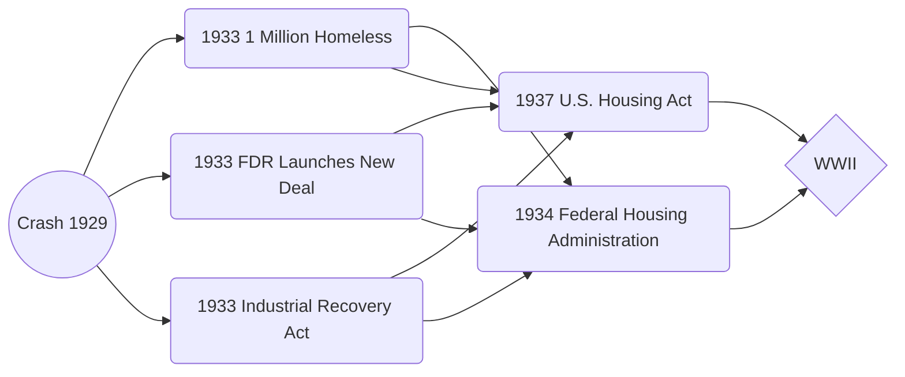

# Economic Depression

## Opening Quote
"No country, however rich, can afford the waste of its human resources. Demoralization caused by vast unemployment is our greatest extravagance. Morally, it is the greatest menace to our social order." [1](https://www.nps.gov/frde/learn/photosmultimedia/quotations.htm)
--- FDR - September 30, 1934

## Background
enter link description here
The Great Depression was the worst economic downturn in the history of the industrialized world, lasting from 1929 to 1939. It began after the [stock market crash](https://www.history.com/topics/great-depression/1929-stock-market-crash) of October 1929, which sent [Wall Street](https://www.history.com/topics/us-states/wall-street-timeline) into a panic and wiped out millions of investors. Over the next several years, consumer spending and investment dropped, causing steep declines in industrial output and employment as failing companies laid off workers. By 1933, when the Great Depression reached its lowest point, some 15 million Americans were unemployed and nearly half the country’s banks had failed. 

## The New Deal: A Road to Recovery

[Short Video](https://aetv.global.ssl.fastly.net/i/AETN-History_VMS/History_FDR_New_Deal_rev_2SF_re1_S3_,18,13,10,7,4,2,1,00.mp4.csmil/master.m3u8) 

Among the programs and institutions of the  [New Deal](https://www.history.com/topics/new-deal)  that aided in recovery from the Great Depression were the  [Tennessee Valley Authority (TVA)](https://www.history.com/topics/history-of-the-tva), which built dams and hydroelectric projects to control flooding and provide electric power to the impoverished  [Tennessee](https://www.history.com/topics/us-states/tennessee)  Valley region, and the  [Works Progress Administration (WPA)](https://www.history.com/topics/works-progress-administration), a permanent jobs program that employed 8.5 million people from 1935 to 1943.

When the Great Depression began, the United States was the only industrialized country in the world without some form of unemployment insurance or social security. In 1935, Congress passed the  [Social Security Act](https://www.history.com/topics/social-security-act), which for the first time provided Americans with unemployment, disability and pensions for old age.

After showing early signs of recovery beginning in the spring of 1933, the economy continued to improve throughout the next three years, during which real GDP (adjusted for inflation) grew at an average rate of 9 percent per year.
## Timeline

## Primary Source Stations Activity

[Use this link to access the activity!](https://drive.google.com/file/d/1E21oYalPy7mVk-dDDOa_F48Iw6VuFIaa/view?usp=sharing)

## Causes of the Great Depression
/effects-of-the-great-depression-4049299_color-ee216e5075ed41dab66b9b42a8c09619.png)
1.  The Great Depression started on Wall Street
2.  Herbert Hoover was president during the start of the Great Depression
3.  The peak of the Great Depression was during 1932 to 1933
4.  The Great Depression caused social upheaval and political unrest
5.  Trade policies made the Great Depression worse
6.  The Dust Bowl occurred during the Great Depression
7.  Crime increased during the Great Depression
8.  Franklin D. Roosevelt became president during the Great Depression and took immediate action to try to stabilize the country
9.  The Great Depression had global impacts
10.  World War II effectively ended the Great Depression

<!--stackedit_data:
eyJoaXN0b3J5IjpbLTEyNzk3OTY0MzRdfQ==
-->