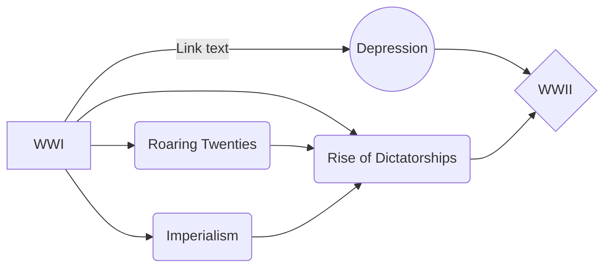

# The Interwar Period


In the history of the 20th century, the interwar period lasted from 11 November 1918 to 1 September 1939 (20 years, 9 months and 21 days), the end of the First World War and the beginning of the Second World War. The interwar period was relatively short, yet featured many significant social, political, and economic changes throughout the world. Petroleum-based energy production and associated mechanisation led to the prosperous Roaring Twenties, a time of both social mobility and economic mobility for the middle class. Automobiles, electric lighting, radio, and more became common among populations in the developed world. The indulgences of the era subsequently were followed by the Great Depression, an unprecedented worldwide economic downturn that severely damaged many of the world's largest economies.
## Video

We will be using **[this video](https://www.youtube.com/watch?v=xzWL2XPBHMk)** to explore the interwar period in more dept. The video will take us through the end of World War I and how Europe in particular found itself at the door of World War II. 
## A Japanese poster promoting the Axis cooperation in 1938


# Map of Europe 1923


## Empires

A look a three empires during the interwar period.

|                |Population                          |Land                         |
|----------------|-------------------------------|-----------------------------|
|British Empire|458 million          |25% of the world's land surface            |
|French Empire          |150 million            |46,098 sq. mi            |
|Italian Empire          |42,993,602|1,466,000 sq mi|.
# The Interwar Period:
 


```
