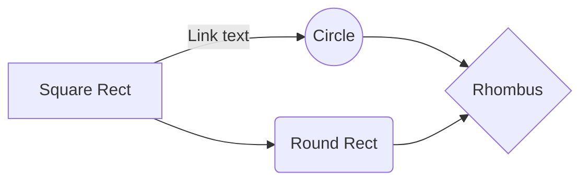

## Markdown Tutorial for EDU 5527
The goal of this tutorial is to demonstrate some basic things you can do in and with [Markdown](https://en.wikipedia.org/wiki/Markdown).

### Formatting
Bold
**bold**
Italics
*italics*

### Links
[Alt text](url)

Example text:
Let's see what Wikipedia has to say about Educational Technology

Markdown text
Let's see what **Wikipedia** has to say about *Educational Technology.* Let's follow this [link](https://en.wikipedia.org/wiki/Educational_technology). 

### Adding Images
An image: 


How about these snowmen: 

### Tables
Sample:
Item | Value
-------- | -----
Computer  | $1600
Phone | $12
Pipe | $1

## Diagrams, Charts, Etc.
Here are some samples:



````mermaid

graph BT
A[Hard edge] -->B(Round edge)
    B --> C{Decision}
    C -->|One| D[Result one]
    C -->|Two| E[Result two]
````

````mermaid
pie
    title Cats, Dogs, and Rats: A Sad Story
    "Dogs" : 200
    "Cats" : 35
    "Rats" : 179
````

````mermaid
sequenceDiagram
    participant Alice
    participant Bob
    Alice->>John: Hello John, how are you?
    loop Healthcheck
        John->>John: Fight against hypochondria
    end
    Note right of John: Rational thoughts <br/>prevail!
    John-->>Alice: Great!
    John->>Bob: How about you?
    Bob-->>John: Jolly good!
````


